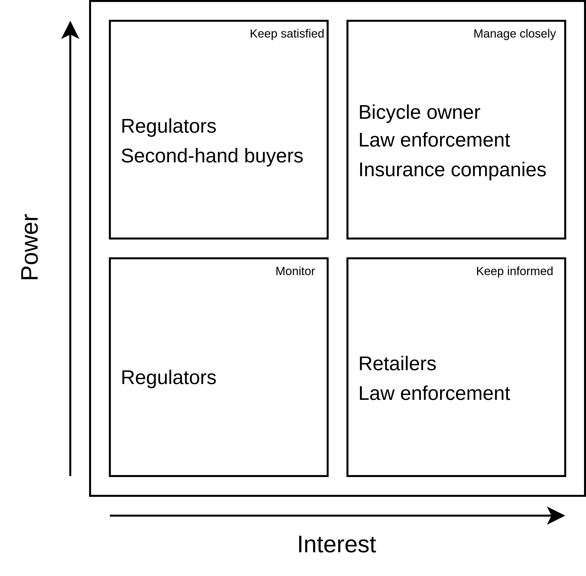
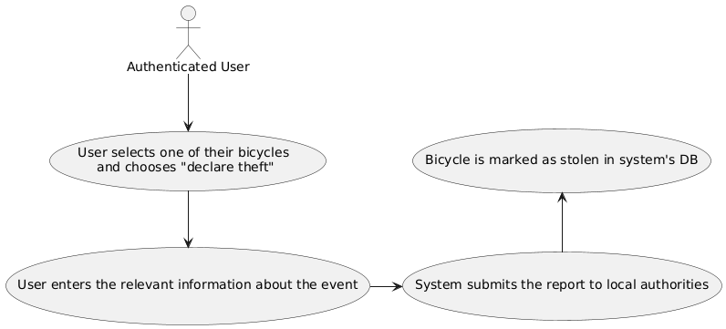
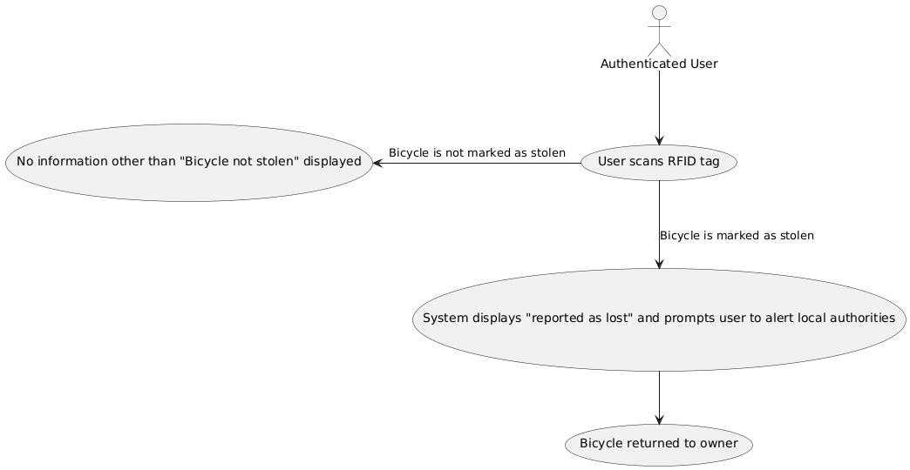
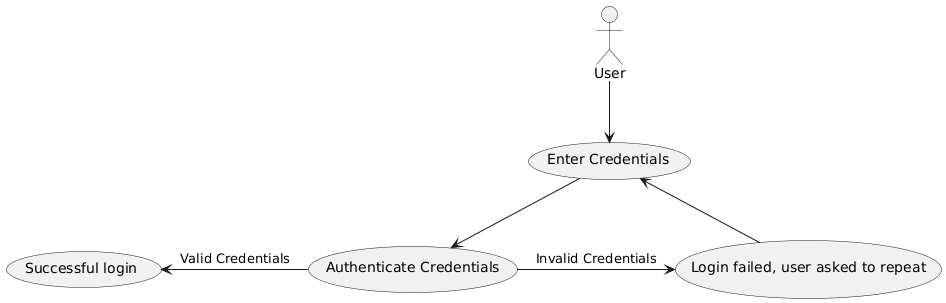
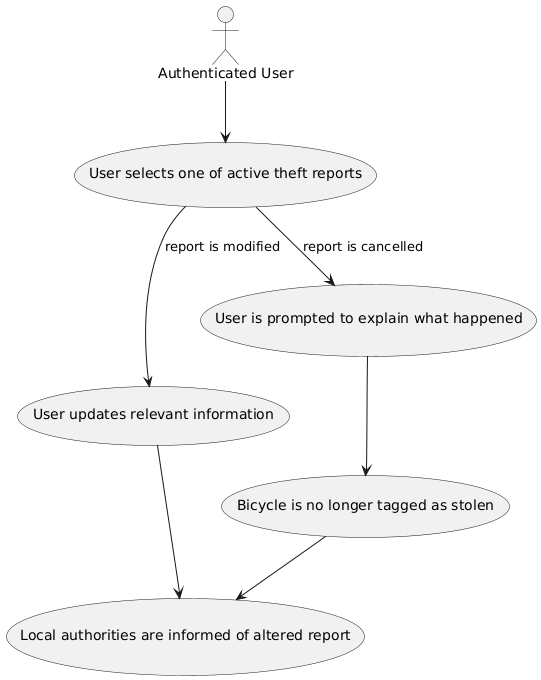
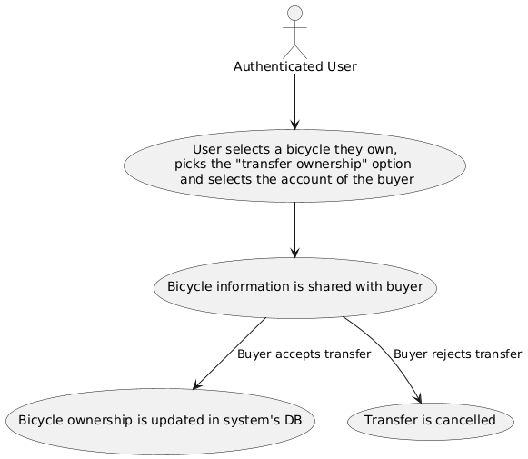
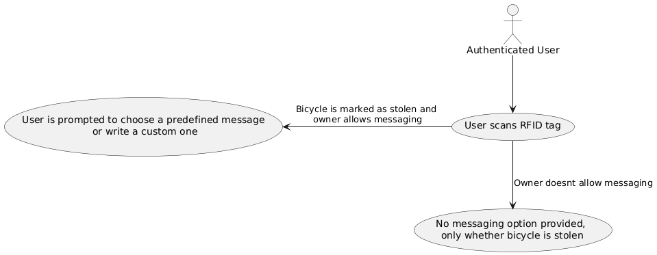
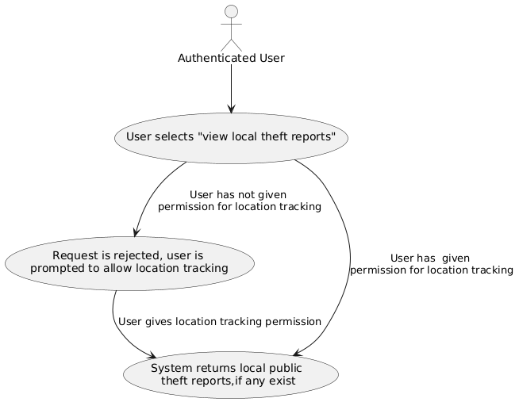

## 1. Problem Description

Cycling is a major mode of transport in the Netherlands. For each person there were 1.3 bicycles in 2023 in the Netherlands[^3]. Between 468.000 and 772.000 bicycles are stolen each year[^1]. Many of these bicycles are sold to new owners. The selling or purchasing of stolen goods, if you at least suspect a product may be stolen, is illegal in the Netherlands and is punishable by a prison sentence or a fine up to €87,000 [^5]. Many buyers of stolen bicycles however do not know the bicycle they are buying may be stolen.

ISO 3779 defines a standard for vehicle identification numbers (VINs)[^2]. All bicycles sold in the Netherlands are required to have such a VIN or _frame number_. Frame numbers are either stamped into the frame or printed on a sticker. Databases exist that link stolen bicycles to their rightful owner. In order to ensure the effectiveness of such a system, a number of conditions need to be met:

1. Each owner stores the frame number of their bicycle into the system before a theft has occured.
2. The database in which these frame numbers are stored should be publicly accessible.
3. Individuals should be able to make use of this public database, by checking the frame numbers of bicycles that they encounter against the database of stolen bicycles.

The process of checking a bicycle's frame number against the database currently is a manual process. A person first needs to find the frame number on the bicycle which is usually not located in a standardized place and then manually copy the number into their phone/computer. Modern bicycles commonly have a sticker that also has a barcode encoded with the frame number. This barcode is however still hard to scan in an automated manner as its location is not standardized. Additionally, the barcode is easy to remove as it simply is a sticker under a clear layer of paint.

Due to these reasons, the process of registering and recovering stolen bicycles remains inefficient. We aim to solve this with BiCycure!

### 1.1 Existing Solutions

We analyze two systems that are currently recommended by Dutch law enforcement [^6]: _Stop Heling_ and _RDW fietsdiefstalregister_, as well as an approach attempted by the bike lock company, Axa.

#### 1.1.1 Stop Heling

Stop Heling is an Android and IOS application that lets a user store entries of products they own locally. Entries contain a VIN, a textual description and/or pictures of the product. Only once a theft takes place will the data of the stolen product be uploaded to the central database. The Stop Heling app can also be used to check whether a VIN is registered as stolen. This is done either by manually entering the VIN or by scanning a barcode using the camera. Thefts cannot be reported using the app but rather need to be filed to the Dutch police, much like any other crime report.

#### 1.1.2 RDW fietsendiefstalregister

RDW fietsendiefstalregister, or _bicycle theft register_, is a database much like Stop Heling. RDW does not provide an app similar to Stop Heling to interface with the database. It may be that the database content of Stop Heling and RDW fietsendiefstalregister is the same, as data seems to come from the Dutch police in both cases.

#### 1.1.3 Protagtor

In 2001, AXA introduced the **Protagtor**, a bike lock with an embedded chip that was supposed to make stolen bikes easily traceable. The bike’s details, including the chip code, could be registered online, and users could update the status of their bike in case of theft.

#### 1.1.4 Problems with current solutions

To evaluate the solutions currently in use, we have to refer back to the system's prerequisites outlined earlier.

RDW does not allow for registration of frame numbers before theft occurs (therefore contradicting condition 1), and checking whether a bicycle is stolen is quite cumbersome (failing condition 3). On the other hand Stop Heling provides a nice user experience for storing VINs, making the fullfilment of condition 1 much more likely, however it doesn't improve upon RDW's model when it comes to condition 3. It is clear that any alternative to the existing solutions should allow for straightforward theft checking, while also exploring the idea of automated checks in an appropriate manner. Moreover, both solutions require directly contacting the police in order to mark an item as stolen, a process which is often inconvienient enough that owners end up skipping it.

As for the Protagtor, by 2014 bike manufacturers stopped using the chip-based locks, as the locks, being one of the first things thieves remove, did not effectively prevent theft. Locks with these chips were marked with the code **DPC**, but police rarely scanned for them, and bike owners stopped registering them online. Most systems still rely on manual entry, and newer technologies like chips and barcodes have not solved the problem effectively due to low adoption and ease of removal by thieves.

For reference, in 2021 61 percent of bicycle thefts went unreported, hindering citizens ability to check whether they are purchasing stolen goods.

### 1.2 Stakeholder Analysis

When developing a system like BiCycure, it is important to consider the needs and interests of all key stakeholders.

First and foremost, the bicycle owners will be the primary users of the system, and require a reliable and user-friendly method to store the unique identifiers of their bicycles and easily report them as stolen if necessary. Law enforcement also plays a crucial role in the bicycle recovery process, which becomes more manageable when a bigger portion of stolen bicycles are properly registered in a database. Bicycure should take into account the legal framework for theft reporting in order to implement the feature of bicycle theft reporting through the application. Additionally, increasing the number of bicycles checked to verify ownership, whether by law enforcement or third-party entities, further enhances theft prevention efforts.

Moreover, when bicycle theft rates are high, retailers often suffer financially, as customers may become reluctant to purchase expensive or new bicycles due to the increased risk of loss. Consequently, they can serve an instrumental role by implementing the bicycle registration to the system's database in the purchasing process, contributing to the system’s effectiveness. Second-hand buyers are another important group, as they are motivated not to purchase stolen bicycles by both ethical concerns and the fear of legal consequences. However, these motivations do not always translate into action, so making the process of checking whether a bicycle is stolen and transferring ownership as simple and seamless as possible is key to improving their participation. Finally, insurance companies stand to benefit from a reduction in bicycle theft, as fewer stolen bicycles lead to fewer payouts.

This alignment of interests makes the government, retailers and insurance companies potential sources of funding for the development and maintenance of a system like BiCycure.

### 1.3 Sources of Ambiguity

Before we proceed with the implementation, a few sources of ambiguity have to be tackled and resolved. This will ensure that an effective system is developed.

1. **Technology Implementation**: The specific technology to be used for bicycle identification (RFID tags, engraved bar codes, or other options) needs to be determined based on factors such as reliability, cost, and ease of implementation.
2. **Regulatory Compliance**: The specific legal and regulatory requirements that the system must adhere to in the Netherlands need to be identified and addressed.
3. **System Goals**: The scope of this problem is huge. In order to not stray from the core problem, it is important that the team have a very clear understanding of what we're trying to solve and how we're going to solve it. In order to navigate this problem effectively and not get lost in the process, we have created a list of [requirements](#appendix-b-requirements) that will help the team achieve exactly what we set out to do.

## 2. Solution Design

### 2.1 Proposed Solution and Benefits

We propose BiCycure, a system that will include a suite of features which aim to modernize bicycle ownership, security and recovery. We aim to help millions of cyclists protect their cherished companions and enable local communities to contribute to a safer and more connected environment for every individual residing in the Netherlands.

Our hope is that BiCycure will function as an obstacle during every step of bicycle related crimes: a deterrent for bicycle thieves, a safeguard against the purchase of stolen bikes by providing clear ownership verification to would-be buyers, and a tool for law enforcement to achieve a quick recovery and return of the stolen bicycle to its owner.

We believe that the proposed system will act as a significant leap forward in the digital ownership of bicycles when compared to existing technologies, due to the central role that individuals and local communities play in it.

The issues which plague current alternatives can be combated using the following proposed features of BiCycure:

#### 2.1.1 **Verification of ownership**

Each bicycle is assigned to an individual through the integration of an RFID tag, which serves as a unique identifier for the bike. Unlike traditional frame numbers which can relatively easily be altered or removed, the tags are tamper proof, and therefore cannot be removed by thieves without causing damage to the bicycle.

One of the advantages of this approach is the speed and efficiency it offers for ownership verification by the authorities when required. This rapid verification process can help deter bike theft, as the likelihood of getting caught increases for potential thieves.

#### 2.1.2 **Declaration of theft**

If a bicycle is stolen, the owner can declare this in the system, which will automatically submit a relevant report to law enforcement and will cause subsequent scans of the RFID chip to indicate the bicycle as stolen. The owner is also able to make this declaration public: this option will reveal the owner's bicycle and contact information to individuals who scan the RFID chip, allowing for direct communication between the two parties. Additionally, the owner will be able to set a financial reward which they wish to grant to the individual who assists in the recovery of the bicycle.

This represents a significant step forward for the recovery of stolen bicycles, since individuals will be able to quickly discover whether a bicycle is stolen and act accordingly, while also respecting the privacy of the owner. Furthermore, we believe that this will lower the amount of bike thefts since the ownership (or lack thereof) of the bicycle will be easily provable, and will encourage community involvement in the recovery process.

#### 2.1.3 **Transfer of ownership**

When two individuals come to an agreement regarding transfer of ownership, the system will seamlessly reflect this change upon receiving a bilateral confirmation. This model ensures a smooth transition of ownership and also creates a digital trace of the transaction that can be referenced for any future legal purposes.

This ownership transfer model improves upon the traditional alternatives, in which documentation can often be cumbersome and prone to error, since the digital nature of the transaction provides an additional layer of security and accessibility.

#### 2.1.4 **Tracking of bicycle history**

The system keeps a comprehensive, tamper-proof record of each bicycle’s history, including past ownership, repairs, and maintenance. This history is accessible to users for verification before ownership transfer, reducing the risk of fraud and ensuring transparency. It also assists law enforcement by providing detailed background information on stolen bicycles, helping to track their history and ownership more effectively.

### 2.2 Quality Attributes

Based on our stakeholder analysis and problem definition, we have derived several key qualities that are essential for the proper functioning of BiCycure.

One such quality is usability, due to the diverse nature and differing levels of techological fluency of stakeholders who will interact with BiCycure. To ensure accessibility for all, the interface must be intuitive and user-friendly, employing simple instructions and feedback mechanisms, and a user-friendly software interface. This emphasis on usability is critical for encouraging widespread adoption and ensuring that users feel comfortable interacting with the system.

The second most important quality, given the potential userbase of tens of millions, is scalability. The system must be designed to handle this growing volume without experiencing performance issues, ensuring that it remains responsive and reliable even as demand increases.

Another crucial aspect is privacy, as users will be required to submit sensitive personal information when registering and posting theft reports with BiCycure. Only authorized individuals should have access to this data, and strict confidentiality must be ensured by using proper methods of encryption data management practices. Regular compliance checks will be vital to maintain the legality of stored user information.

Lastly, portability should be taken into account. While the initial version of BiCycure will be available through a mobile application, a web version could be created as well, allowing individuals to manage their bicycle information from any device, and making BiCycure more versatile and user-friendly. Therefore the system should be designed with cross platform compatibility in mind, while respecting the importance of usability on the user end.

### 2.3 Scenarios

To illustrate how BiCycure will operate in real-world situations, we present several use case scenarios. Each scenario highlights the interactions between users and the system and therefore acts as an important resource for making architectural choices regarding the system design. Additional use cases can be found in [Appendix A](#appendix-a-use-cases).

##### Use Case Scenarios:

1. An individual is assigned as the owner of a new bicycle.

   **Preconditions**: The user is authenticated and has an RFID chip to scan.

   The user scans the RFID chip. If the bicycle is registered in the system's DB, they are informed accordingly. If not, they are prompted to confirm the bicycle details, which then marks it as their property.

   **Postconditions**: The bicycle is either recognized as stolen or marked as the user's property in the system.

   

2. An individual who owns a bicycle declares that the bike has been stolen.

   **Preconditions**: The user is authenticated and has a bicycle they wish to declare as stolen.

   The user selects a bicycle, enters details about the theft, and submits the report.

   **Postconditions**: The bicycle is recorded as stolen in the system, and the theft report is submitted to local authorities.

   

3. An individual, a repairperson or a legal authority wants to check whether a bicycle has been registered as stolen.
   **Preconditions**: The user is authenticated and has an RFID tag of a foreign bicycle to scan.

   The user scans the tag, and the system checks the status. If not reported lost, the user is notified accordingly. If reported lost, the system prompts the user to notify the local authorities.

   **Postconditions**: The user is informed about the bicycle's status and can initiate communication with the owner for its return if needed.
   

## 3. Proposed Roadmap

We propose that BiCycure should be developed in three distinct stages.

During the first stage, the developer team will conduct research on key areas that are relevant to the realization of the system. Such areas include the current bicycle registration systems that were analyzed in [1.1](#11-existing-solutions) and proposed alternatives and strengths and limitations of present theft prevention measures. After the completion of this phase, the developer team will have a clear idea of the highest priority features that need to be implemented in the MVP in order for it to be a functioning product.

In the second stage, the team will shift their focus on developing the fundamental features that were realised in stage one. These core features will serve as the foundation for the MVP (Minimum Viable Product), which when completed will instantly be able to deliver value to users and begin tackling the problem of bicycle theft. Moreover, in this stage the team will collaborate with bicycle manufacturers and retailers in order to incorporate the MVP into new bicycles, while also making the MVP available to the public. When this phase concludes, the team will be able to pinpoint features that operate as expected and others that require improvement, as well as possible additions, based on the gathered feedback from users.

The development will be completed with the third stage, in which the developers will expand the MVP of BiCycure as well as ensure the system's adherence to the proposed quality attributes. This will include tweaks to current features and the development of new ones based on the feedback gathered in stage two. Moreover, the team will aim to form partnerships with a greater number of bicycle manufacturers to increase the system’s reach and ensure it is integrated into as many new bicycles as possible, thereby maximizing its adoption among consumers and likelihood of success. Maintainance of the system continuously takes place in parallel to the development and integration of new features.

## 4. Revenue Generation

While this project focuses on reducing bicycle theft through RFID technology, the question of long-term sustainability and resource management arises as the system expands. If scaled, the system would require more resources such as server capacity, maintenance, and possibly expanded legal and operational oversight.

1. **Government Partnership**: Given the public safety focus, the project could become a government-backed initiative. If digital frame numbers become a legal requirement, government funding or subsidies could cover the system's development, operation, and maintenance, similar to national registries for vehicles.

2. **Partnership with Insurance Companies**: Collaborating with insurers could generate revenue through referral fees or partnerships. For instance, users who register their bicycles could be offered insurance options, creating a revenue-sharing model between the platform and insurance providers.

# Appendix

## Appendix A: Use Cases

##### 1. User Authentication:

**Preconditions**: The user has access to the login interface and possesses valid or invalid credentials.

The user enters their credentials, and the system authenticates them. If the credentials are invalid, the user is prompted to retry. If valid, the user successfully logs in.

**Postconditions**: The user is either logged into the system or remains at the login screen with a notification of failure.

##### 2. Updating Theft Reports:

**Preconditions**: The user is authenticated and has active theft reports to modify or cancel.

The user selects a report to update it, which updates the public theft report on Bicycure, or they can cancel the report by explaining the situation and entering details about assistance received from other users.

**Postconditions**: The report is either updated or canceled, and the bicycle's status is changed to no longer tagged as stolen.

##### 3. Transfer Bike Ownership:

**Preconditions**: The user is authenticated and has a bicycle they wish to transfer ownership of.

The user selects the bicycle and the buyer’s account to initiate the transfer. After
receiving information about the history of the transfer, the buyer confirms or rejects the transfer.

**Postconditions**: The bicycle's ownership is updated in the system's database, reflecting the new owner, or in case of rejection no change is made.

##### 4. Messaging Bicycle Owners:

**Preconditions**: The user is authenticated and has scanned an RFID tag of a bicycle.

Upon scanning a stolen bicycle the user is either prompted to send a message to the bicycle's owner or alert the authorities, based on the owner's preference. If the bicycle is not stolen, the scanner only sees the status of the bicycle (not stolen).

**Postconditions**: An anonymous message is delivered to the owner, or the user is informed that messaging is not available and is prompted to alert the authorities.

##### 5. Nearby Stolen Bicycle Lookup:

**Preconditions**: The user is authenticated and has allowed the system to access their geographical location.

The user selects the "view local theft reports" option. The system cross references their location with the public theft reports which are stored in its database.

**Postconditions**: The user is shown public active theft reports which have been submitted in nearby areas. If no such reports exist, the user is informed accordingly by the system.

## Appendix B: Requirements

#### Functional Requirements:

##### Must Have:

- Users must be able to register themselves on the system with their unique government-issued ID (like a BSN or something similar).
- Users must be able to register their bicycles in the system.
- Users must be able to report their bicycles as stolen.
- Law enforcement must be able to scan bicycle identifiers and check against the stolen bicycle database.
- The system must securely store bicycle ownership information.

##### Should Have:

- Users should be able to transfer bicycle ownership through the app.
- Users should be able to offer rewards for recovered bicycles.
- The system should send notifications to users when their stolen bicycle is scanned.

##### Could Have:

- The system could provide statistics on bicycle theft patterns.

##### Won't Have:

- The system won't provide real-time GPS tracking of bicycles.
- The system won't be the platform on which monetary rewards are awarded, that must happen offline.

##### Non-Functional Requirements

- The system must comply with GDPR and other relevant data protection regulations.
- The mobile application must be available on both iOS and Android platforms.
- The scanning process should take no more than 1 second.
- The system should be able to handle millions of bicycle registrations.

[^1]: **Fietsersbond. "Fietsdiefstal: feiten en cijfers over fietsdiefstal."** https://www.fietsersbond.nl/onderweg/fietsdiefstal/feiten-en-cijfers-over-fietsdiefstal/ Last accessed September 17 2024.
[^2]: **International Organization for Standardization. "Road vehicles — Vehicle identification number (VIN) ISO 3779:2009."** https://www.iso.org/standard/52200.html
[^3]: **Stichting BOVAG RAI Mobiliteit. Kerncijfers tweewielers 2023.** https://www.raivereniging.nl/actueel/nieuws/kerncijfers-auto-and-mobiliteit-en-tweewielers-2022-gepubliceerd/. Last accessed September 18 2024.
[^4]: **Fietsersbond. "Antidiefstalchip."** https://www.fietsersbond.nl/onderweg/fietsdiefstal/preventie/antidiefstalchip/ Last accessed September 18 2024.
[^5]: **Ministry of Justice and Security. StopHeling.nl.** https://stopheling.nl/en Last accessed September 18 2024.
[^6]: **Politie. "Hoe kan ik online controleren of een fiets gestolen is?"** https://www.politie.nl/informatie/kan-ik-online-controleren-of-een-fiets-gestolen-is.html Last accessed September 18 2024.
[^7]: **Bureau Beke. "Fietsdiefstal in herhaling, een tweede onderzoek onder slachtoffers."** https://bureaubeke.nl/wp-content/uploads/2023/11/Fietsdiefstal-in-herhaling-eindnotitie.pdf

<!--
The following is taken from a sample project. Citations can be made as follows: [^1MRIOS] and [^2]
-->
