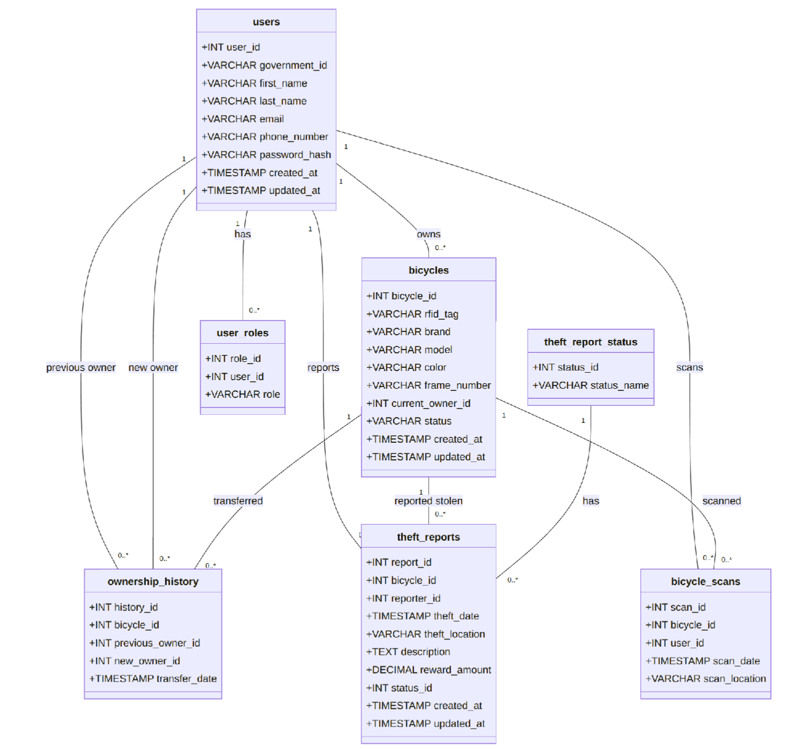
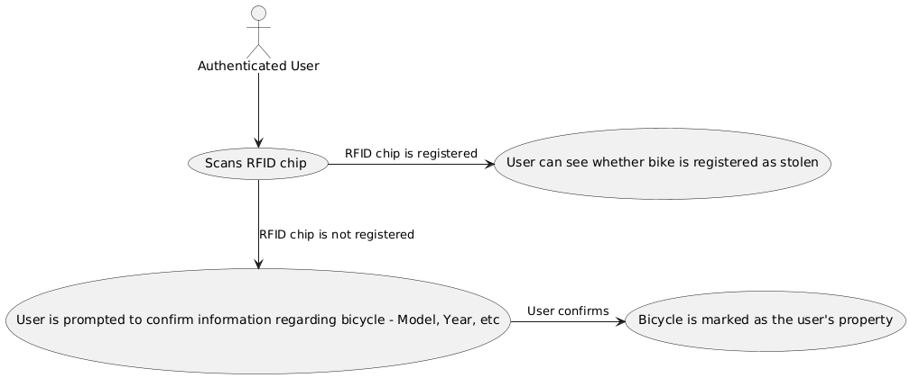
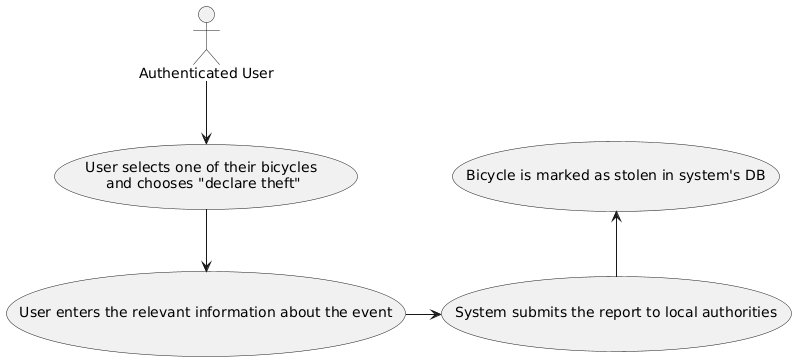

# Introduction: Lessons Learned from the Problem Analysis

In a previous post[^1] we presented the key ideas behind BiCycure. We analyzed the state of the art, determined whose interest should be taken into account and what the system should broadly do. Bicycle owners and insurance companies are stakeholders who should be managed closely. The system's success hinges on whether it is easy to use for every _potential_ bicycle owner in the Netherlands and scanning of bicycles can be easily done on a large scale.

The purpose of this post is to lay out an architectural framework for the system such that a development team would have a clear idea of our vision of how BiCycure would be implemented. We decided to present our system architecture by combining sections of the Arc42[^2] and C4 diagram model[^5] templates, with the additions of Hardware and Security views, due to their heightened importance in our system.

[Goals and Solution Strategy](#goals-and-solution-strategy) elaborates on how the goals which were concluded from the problem analysis are to be achieved through system design choices. [Hardware View](#hardware-view), [Building Block View](#building-block-view), [Runtime View](#runtime-view), and [Security View](#security-view) shine light on various aspects of the system in order to provide a well rounded architectural specification. [Architecture Decisions](#architecture-decisions) elaborates on key decisions that were made in order to build a robust system and provides the reasoning behind why the architecture is chosen as it is presented in this post.

# Goals and Solution Strategy

In our first report[^1], we identified various goals and requirements for the system which we consider necessary for its success.

Specifically, within our system:

- Users must be able to register themselves on the system with their unique government-issued ID (like a BSN or something similar).
- Users must be able to register their bicycles in the system.
- Users must be able to report their bicycles as stolen.
- Law enforcement must be able to scan bicycle identifiers and check against the stolen bicycle database.
- Bicycle ownership information must be securely stored.

However, we did not elaborate on how these targets are to be achieved. This section aims to give a broad impression of how all these goals and requirements are to be met.

In order to significantly shrink the bicycle theft problem we have concluded that BiCycure needs to make sure:

1. bicycle identification codes are stored by the owner before the bicycle is stolen.
2. bicycle identification codes of stolen bicycles are entered into a database that is accessible for those involved in point _3._
3. bicycles out in the wild have their frame numbers commonly checked against the database of stolen bicycles.

This requires replacing existing mechanisms with automated ones that are fast (_scalability_) and easy (_usability_ & _portability_) to use for the masses. Given the proposed high degree of automation, _privacy_ becomes even more important than in existing systems as adversaries may also use this ability to scan bicycles on a larger scale.

## Quality goals

| **Key Quality Goal** | **Scenario**                                                                                                                                                                                                                                                    | **Solution Approach**                                                                                                                                                                                                                                                                                                                                                                                           |
| -------------------- | --------------------------------------------------------------------------------------------------------------------------------------------------------------------------------------------------------------------------------------------------------------- | --------------------------------------------------------------------------------------------------------------------------------------------------------------------------------------------------------------------------------------------------------------------------------------------------------------------------------------------------------------------------------------------------------------- |
| **Usability**        | Users of all ages and technological proficiency should be able to register bicycles, report thefts, and check ownership status without difficulty.                                                                                                              | Design an intuitive user interface (UI) with clear instructions, guided steps, and easy feedback mechanisms. Perform user testing with diverse demographic groups to ensure broad accessibility. Allow for exporting of data to pdf with a QR code containing all essential data for an account with a given bicycle such that the identifier can also be provided on paper with the purchase of a new bicycle. |
| **Scalability**      | The system must handle millions of bicycles and users without performance degradation.                                                                                                                                                                          | Use a cloud-based infrastructure with auto-scaling capabilities. Employ a strong separation of concerns to divide features into independent, scalable components.                                                                                                                                                                                                                                               |
| **Privacy**          | Personal data, including ownership details and theft reports, must be securely stored and accessible only to authorized parties. As much information as possible should only be stored locally on the users device, for instance when no report has been filed. | BiCycure ensures privacy with role-based access control, encrypted data, hashed bicycle UUIDs, and multi-factor authentication via DigID. No security is self-implemented but rather existing security tools are used to protect sensitive data.                                                                                                                                                                |
| **Portability**      | Users should be able to manage their bicycles from multiple platforms such as a mobile app and a web app.                                                                                                                                                       | Develop cross-platform applications using responsive design and technologies like Flutter[^3] to ensure compatibility across devices.                                                                                                                                                                                                                                                                           |

### Quality tradeoffs

In order to properly establish our aforementioned quality attributes, we made a conscious choice of tradeoff based on how these qualities impact each other [^4].

Making a system highly usable, by focusing on streamlined UI and simple interactions, often comes at the expense of **extensibility**. The lack of extensibility would hinder systems whose development is based on adding a lot of new features throughout their development, however BiCycure's features are mostly realized at this point and no extensive updates are likely to be required in the future.

Furthermore, our focus on cross-platform development leads to the usage of more standardized and abstract code, which is likely to reduce **configurability** in certain operating systems. For example, system specific settings and features might not be taken fully advantage of, limiting the developers' ability to fine tune the system's performance on certain platforms. Since BiCycure is currently primarily focused on being as accessible as possible to its potential user base throughout a variety of platforms, this is not a current concern.

## Design Principles and Development Guidelines

A number of design principles and development guidelines are identified to be important to this project:

**Principle of Least Astonishment** In BiCycure the software architecture itself is an enabler of a novel application of technologies. A strong design is not the product but rather a tool which helps teams create a valuable application. The principle of least astonishment states that systems should be designed in a way that most people (architects & developers) would expect it to behave. This minimizes surprises and allows individuals to focus as much as possible on things that are important for their work.

**Stateless Communication** Each request from the mobile application to the backend should contain all necessary information to process the request independently. This makes the logic on the backend easier to understand and process for developers.

**Modularity** Each building block of the system should be designed to be independent of the rest of the system and communicate using well documented interfaces. This allows individual parts of the system to be improved, optimized or replaced altogether without the need for altering the entire system. Modularity allows greater separation of concerns between different development teams (or even individual developers). This allows such teams to experience full ownership of given components of the system.

**Maximum Automation** The goal of BiCycure is to make storing unique identification data of a bicycle as easy and quick as possible. Automation plays a big role in this, as automating things such as filling out text fields reduces friction between the user and the system they are interacting with. The easier the time of the user the more successful BiCycure becomes.

<!-- TODO: can maybe add SOLID principles?  -->

These principles and guidelines serve as a framework which structures the work of development teams. The principles also serve as a reference for stakeholders and the adherence should constantly be monitored in order to ensure efficient use of everyone's time and efforts.

# Hardware View

Before we dive into deeper views of the software architecture we will first give readers a concrete impression of what physical objects the system intends to interact with and where it fits in this physical world.

Bicycles are embedded with RFID tags (NFC tags) that uniquely identify the bicycle. New bicycles that have recently been produced are manufactured with the tags physically embedded into the frame at the seat post. Older bicycles can be retrofitted with a tag inside the seat post as this is generally hollow.

As the location of the tags is standardized it now becomes trivial to scan the identifier of any bicycle and test it using an automated manner against all entries of stolen bicycles in the database. This allows a user to quickly test many bicycles in little time. Our vision is that bicycles in the future could be scanned in an automated manner, which would constitute a big improvement in efficiency and accuracy when compared to the current model of checking against frame numbers.

# Building Block View

In order to present a holistic view of the BiCycure system, we present the following abstractions over it, following the C4 diagram model[^5]:

1. Context View
2. Container View
3. Component View
4. Class View

## Context View

The following model aims to illustrate the architecture of the BiCycure system on a high level in terms understandable to a layman, by highlighting key components, external systems, and primary user interactions.

## Container View

The Bicycure system which is in the center of the context view can be split into three distinct containers that operate alongside each other, which are:

**Mobile App**:

- The mobile application communicates with the backend API to perform various operations such as registering a bike, reporting theft and retrieving user information.
- It handles user input, displays relevant data, and provides feedback (e.g., loading indicators and success/error messages).

**[Backend Server](#why-golang)**:

- The server processes incoming requests from the mobile app.
- It performs operations on the database based on the received requests.
- It sends responses back to the mobile app, indicating the success or failure of the requested operations.

**Database**:

- The database stores all relevant information, including user details, RFID tag information, and the status of registered bikes.
- It is accessed by the backend server for data retrieval and updates.

The following view shows the aforementioned interactions and relationships between the containers.

## Component View

The BiCycure system consists of several key components that work together to provide bicycle registration and theft prevention services. The system's component architecture can be broken down into the following main elements:

#### Frontend Components

##### Mobile App and Web Application [Containers]

- Both interfaces serve as the main UI for users to interact with the system.
- Built for iOS/Android (mobile) and web browsers respectively.
- Make API calls to various backend controllers to perform operations.

#### Backend Components

##### Authentication Controller

- Primary responsibility: User Registration and Login management.
- Integrates with DigID (external government authentication system).
- Handles authentication-related API calls from both mobile and web applications.
- Communicates with the Authorization Controller for access control.

##### Authorization Controller

- Central component for security and access control.
- Checks user authorization for all actions within the system.
- Used by all other controllers to verify permissions.
- Ensures users can only access and modify their own data.
- Integrates with the Authentication Controller for user verification.

##### Bicycle Controller

- Manages bicycle registration and scanning functionality.
- Handles API calls related to:
  - New bicycle registration
  - Bicycle information updates
  - RFID tag scanning and verification
- Communicates with the database for bicycle data storage and retrieval.
- Requires authorization checks for sensitive operations.

##### Theft Report Controller

- Manages the creation and handling of theft reports.
- Processes API calls for:
  - Creating new theft reports.
  - Updating existing reports.
  - Managing theft report status.
- Interacts with the database to store and retrieve theft report data.
- Requires authorization validation for report management.

#### Data Storage

##### Database [PostgreSQL]

- Central data store for all system information.
- Receives data operations from multiple controllers:
  - User data from Authentication Controller
  - Bicycle registration data from Bicycle Controller
  - Theft reports from Theft Report Controller

#### Integration Points

##### External System Integration

- DigID Integration:
  - Connected to Authentication Controller
  - Provides government-backed user verification
  - Ensures secure and reliable user authentication

#### Component Interactions

The diagram shows several key interaction patterns:

1. **Frontend to Backend Communication**:

   - All user interactions flow through mobile or web applications.
   - API calls are made to appropriate controllers based on the operation.

2. **Authorization Flow**:

   - All controllers utilize the Authorization Controller.
   - Creates a centralized security check mechanism.

3. **Data Flow**:
   - Controllers manage specific domains of functionality.
   - All persist their data through the central database.
   - Clear separation of concerns between different types of data operations.

## Class view

Going even deeper in our analysis of our system, we examine the various classes which are used to represent the key entities and their relationships.

The "users" class stores essential information about the user and is linked with the "user_roles" class which defines the permissions and role that is assigned to each user within the system. The "bicycles" class maintains information about the registered bicycle, while the "bicycle_scans" class represents the event of a bicycle being scanned by a user who is not its owner. Additionally, the "theft_reports" class holds information regarding a theft that has been reported to the system about a registered bicycle, and the "theft_report_status" helper class serves to indicate the current status of each report (whether it has been resolved or is still active). Finally, the "ownership_history" class acts as a repository for any transfers of ownership that have occurred for a specific bicycle in the period in which it has been registered to the application.

# Runtime View

## User Interaction Flow

**User Registration**:

- The user opens the BiCycure app on their smartphone and navigates to the registration screen and logs in/registers using DigID.
- The app requests the user to scan their bicycle's RFID tag using their smartphone.
- Upon successful scanning, the RFID tag is associated with the user's bike.
- The user fills in additional details (e.g., bike color and specifications) and submits the registration form.
- The app sends the registration data, including the RFID ID, to the backend server through an API call.

**Bike Theft Reporting**:

- In case of theft, the user opens the app and navigates to the theft reporting section.
- The user selects the bicycle that is stolen from the list of their bicycles.
- The app sends a theft report request to the backend, which updates the status of the bike in the database.

**Scanning a Stolen Bicycle**

- If someone comes across a bicycle they suspect is stolen, they can open BiCycure and scan the bike's RFID tag.
- If the bicycle is indeed reported as stolen, the reporter is notified of the same.
- If the owner of the bicycle has enabled the option to let reporters contact them, the reporter will be able to send them a message.
- If not, the reporter will only be informed that the bicycle is reported as stolen. The bicycle's owner will receive a notification stating their bike's last scanned location.

# Security View

## Access control

Access control is a critical component of BiCycure’s architecture to ensure that only authorized users can interact with sensitive data. The system employs a role-based access control (RBAC) model, combined with robust authentication and authorization mechanisms to safeguard access to both the mobile application and backend services.

## Data Security

Data is encrypted in transit. The UUID's which identify individual bicycles are hashed when stored. A bicycle's UUID can be tested against the database simply by hashing it. This means that it is only known which bicycle is stolen by those parties which have access to the actual bicycle's UUID. Multi-factor authentication is used by utilizing the existing DigID infrastructure. No security protocols are implemented by the BiCycure team. Existing well tested tools are used instead.

# Architecture Decisions

This section serves to give the reader a complete impression of the decision process the team went through when determining the architecture of BiCycure. We elaborate on a key decision which shaped the rest of our system greatly; we review five architectural patterns[^9], namely Layered Architecture, Monolithic Architecture, Microkernel Architecture, Peer-to-Peer Architecture, Microservices and Event-Driven Architecture We explain why **Monolithic Architecture** was ultimately chosen for BiCycure and how this impacts the rest of our design choices.

## Exploring the Design Choices

### Layered Architecture

A layered architecture separates software components into distinct layers — for instance, presentation, application, and data layers. While it offers modularity and separation of concerns, it presents several limitations.

**Drawbacks:**

- Communication overhead between layers can degrade performance.
- If layer boundaries aren't well-defined, it could lead to highly coupled layers, which could lead to a huge slowdown in development speed.
- Scalability is constrained by interdependencies, making it difficult to scale individual components.
- Complexity increases significantly with more layers, resulting in later inefficiencies in development.

Given BiCycure's need for fast, real-time RFID scanning and bike registration, adopting a layered architecture is not suitable. Its inherent performance overhead and constrained scalability do not align with the system's need for fast operations and seamless scaling as it grows.

### Microkernel Architecture

Microkernel Architecture (or plugin architecture) separates the core system from additional functionalities provided through plugins. Adopting a microkernel architecture would allow the addition of features to BiCycure to be especially smooth. However, there are significant challenges that we believe outweigh the benefits of this approach.

**Drawbacks:**

- Communication between the core module and plugins lead to performance overhead.
- Managing plugin dependencies and versions adds complexity.
- Not ideal for systems requiring dynamic scalability across components.

For BiCycure, which must efficiently handle real-time data and scale rapidly, the communication overhead in Microkernel Architecture would degrade performance. Furthermore, managing future integrations and APIs through plugins would introduce unnecessary complexity and limit the system's ability to scale dynamically.

### Peer-to-Peer (P2P) Architecture

In a Peer-to-Peer Architecture, each node acts as both client and server, offering a decentralized system. While it is robust and scalable, it comes with significant trade-offs.

**Drawbacks:**

- Security risks: Due to direct connections between multiple peers, the security risks increase significantly.
- Synchronization challenges for large networks, leading to scalability bottlenecks and a different source of truth for different peers.

Although P2P Architecture is highly scalable, its decentralized nature and security concerns make it unsuitable for BiCycure, which requires a more structured, secure, and centralized system for managing bike registration and tracking via RFID tags.

### Microservices Architecture

A microservices architecture allows independent services to communicate through events. Each service handles a specific domain and can scale independently. This architecture is highly scalable and resilient. This approach would be appropriate for BiCycure as it checks all the requirements. However, given the scale of BiCycure and the expected number of concurrent users at its peak, a microservices architecture would actually prove to be overkill for our purposes.

**Drawbacks:**

- Increased operational complexity due to managing multiple services.
- Requires significant infrastructure to manage inter-service communication.
- Initial development and deployment are more complex compared to a monolithic system.

The complexity and need for extensive infrastructure makes this approach illogical for BiCycure. The system’s (small) currently envisioned complexity does not justify the need for independently scalable services at this point and only makes development of a small team more complex than it should be. Microservices might make sense if a very large team of developers is needed, as the separation of concerns benefits may help much in organizing the work. A large user-base alone does not demand a microservices architecture. Keeping in mind the good-old **K**eep**I**t**S**imple**S**tupid adage, we humbly reject the services of this architecture.

### Monolithic Architecture (Chosen Architecture)

Monolithic Architecture involves building the system as a single, unified codebase where all components are tightly integrated. This architecture simplifies development and deployment, making it well-suited for systems with lower complexity, like BiCycure.

**Rationale for Choosing:**

- **Simplicity:** Monolithic Architecture is simpler to implement, especially for a system in its early stages like BiCycure. A single codebase reduces the overhead of managing multiple independent services.
- **Ease of development and deployment:** Since all components are in one place, testing, development, and deployment are more straightforward. Updates can be applied to the entire system in one go.
- **Performance:** With a unified structure, communication between different parts of the system is faster, as there are no service-to-service interactions that require complex event-driven communication.
- **Suitable for small-scale operations:** At this stage, BiCycure does not require independent scalability for its components. The system can handle the expected load with a monolithic structure without introducing the complexity of microservices.

While there are use-cases that would not be possible with a monolithic architecture, particularly in terms of scalability and independent updates, these constraints do not impact BiCycure. The system can operate efficiently under this architecture, and any future need for more complex scalability can be addressed through refactoring as the system grows.

### Conclusion

Although alternative architectures like layered, microkernel, peer-to-peer, and microservices have their own benefits, the **monolithic architecture** best aligns with BiCycure's current requirements. It offers simplicity, better performance for the real-time data handling required by RFID scanning and bike registration, and ease of development and deployment. As BiCycure grows, future architectural changes can be made, but for now, the monolithic architecture is the optimal choice.

# Proof of Concept

In the following sections, we explore each decision we made while building the PoC and explain the rationale behind it.

## Goals

The ultimate goal of BiCycure is to make the process of returning a stolen bicycle to the rightful owner more likely to happen, faster and easier. BiCycure is designed to achieve those goals through automation. However, if this process is to happen smoothly, users need to be able to interact with it in an intuitive manner. Questions that arise are:

1. Does a (new) user quickly understand how they can register a new bicycle to their name?
2. Does a (new) user quickly understand how they can declare one of their bicycles as stolen?
3. Does a (new) user quickly understand how they can scan a bicycle "out in the wild" to check whether it is registered as stolen?

The above questions are based on the three major use case scenarios identified in our earlier blog post: "BiCycure: A Digital Approach To Frame Numbers and Theft Resolution". Additional questions concern the experience of the user:

- Did the user find their interactions with the system pleasant?
- Did the user find their interactions with the system efficient?
- Does the user understand why each step is important to the system?

Our BiCycure proof of concept aims to answer the all above questions with regards to the three major use case scenarios identified earlier. Later in this chapter we lay out a framework that defines the usability tests that is used to evaluate the proof of concept.

## Technologies

We used the following technologies to make our proof-of-concept come to life:

1. **Flutter**: to build a modern, cross-platform mobile application.
2. **Golang**: to build the web server facilitating all of BiCycure's features.
3. **PostgreSQL**: as the relational database to store all of BiCycure's data.

### Why Flutter?

For the BiCycure project, the frontend plays a crucial role in interacting with users and scanning RFID tags to manage bicycles. **Flutter** was selected as the frontend framework for the following reasons:

- **Cross-Platform Development**: Flutter allows the development of apps that can run on both **iOS** and **Android** with a single codebase. Since BiCycure aims to reach a broad audience, this cross-platform capability is essential to ensure widespread availability.

- **Rich UI Design**: Flutter’s **widget-based** system allows for easy customization of UI components. This is important for BiCycure, which needs a modern, user-friendly interface for registering bicycles, scanning RFID tags, and interacting with users.

- **Performance**: Flutter provides near-native performance, making it ideal for real-time applications like BiCycure, where responsiveness is critical when scanning RFID tags and fetching registration details.

### Why Golang?

Golang has recently come up as a very attractive choice to build server side applications. For BiCycure, Go brings several key advantages to the table:

- **Performance**: Go's compiled nature and efficient garbage collection make it blazing fast, ensuring quick response times for RFID scans and database queries. The singular compiled binary allows us to run the server on any machine, irrespective of its architecture.
- **Simplicity**: Go's straightforward syntax and small language specifications reduce the learning curve, allowing our team to be productive quickly and maintain clean, readable code.
- **Strong Standard Library**: Go's robust standard library reduces dependency on third-party packages, enhancing security and simplifying deployment.
- **Cross-platform Support**: Like our Flutter frontend, Go allows us to develop and deploy on various platforms with ease, streamlining our DevOps process.
- **Strong Community Support**: Backed by Google and a very large open-source community, using Golang allows us access to a huge community in case we come across any problems.

These features combine to create a backend that's not only powerful and efficient but also maintainable and scalable as BiCycure grows.

### Why PostgreSQL?

For BiCycure's database needs, PostgreSQL stands out as a robust and reliable choice. There are a number of factors we considered while choosing PostgreSQL:

- **ACID Compliance**: PostgreSQL's full ACID (Atomicity, Consistency, Isolation, Durability) compliance ensures data integrity, crucial for maintaining accurate bicycle and user records.
- **Scalability**: As BiCycure grows, PostgreSQL can handle increasing data loads with ease, supporting both vertical and horizontal scaling options.
- **Advanced Features**: Built-in support for JSON, full-text search, and geospatial data aligns perfectly with BiCycure's needs for storing complex bicycle data and potentially tracking stolen bikes.
- **Reliability**: Known for its rock-solid stability, PostgreSQL minimizes downtime, ensuring BiCycure's services remain accessible to users around the clock.
- **Strong Community**: A strong open-source community means excellent documentation, regular updates, and a wealth of resources for our development team.

By choosing PostgreSQL, we've laid a solid foundation for BiCycure's data management, balancing performance, flexibility, and reliability to support our unique bicycle registration and anti-theft system.

### Security

The PoC incorporated basic security measures to ensure data protection and privacy:

- **Secure API Communication**: All API calls were secured with **HTTPS** to protect the data being transmitted between the app and the backend, ensuring that sensitive information such as user data and bicycle registration details remain encrypted and safe from interception.
- **Encrypt Sensitive Data**: All user-sensitive data, like their passwords, will be stored in an encrypted form in the database to safeguard it against bad actors.

Access to DigID is limited strictly to services related to the government, therefore at this stage of development we thus cannot integrate our PoC with DigID. In this proof-of-concept we have implemented a simple email/password authentication model.

### Quality Assurance

#### Overview of Code Analysis

SonarQube was used to perform a comprehensive static code analysis on the _BiCycure_ project. The charts below illustrate the analysis's findings, which highlight the importance of writing secure, manageable, and high-quality code.

**Bugs: 0 (A grade)**\
The code analysis revealed no defects, suggesting that there are no mistakes in the existing coding that could compromise functioning.

**Vulnerabilities: 0 (A grade)**\
The application's robustness and safety were confirmed when no security flaws were found.

**Hotspots for Security (Grade A)**\
The system appears to have sound security procedures in place because no other security hotspots were discovered.

**Code Smells: Grade B, 964**\
Potential areas for code enhancement are indicated by code smells. The 964 detected code smells (Grade B) should be fixed in subsequent reworking cycles to preserve code cleanliness and long-term maintainability, even if they are not necessarily resulting in immediate functionality problems.

**Coverage: 0.6%**\
At 0.6%, the test coverage is currently very poor. As development moves further, increasing test coverage through improved unit and integration testing will be essential to better validating the accuracy of the system.

**Duplications: 0.0%**\
The codebase is efficient and not redundant because no code duplications were found, which is good for maintainability and lowering technological debt.

**Cyclomatic Complexity: 12**\
The code's difficulty is gauged by the cyclomatic complexity metric, which is 12. Although this is within reasonable bounds, keeping an eye on complexity levels as the codebase expands will help prevent too complicated code, which can result in systems that are more difficult to maintain.

These quality metrics highlight the project's technical health as of right now and point out areas that need work in the future, especially expanding test coverage and fixing code smells. As the project grows, maintaining excellent software quality will need constant monitoring of these indicators.

## Usability Testing

The purpose of these usability tests is to see whether the user has a pleasant and easy interaction with the system where it is most essential. Our usability tests look at the three specific use cases which are essential to our system.

Usability tests automatically fail if the system doesn't technically work, if this is the case it is noted. A real bicycle is used with a unique tag attached at the seat post.

### Test subject instructions and questions

We define exactly what instructions test subjects are given before each of their three tasks.

**Instructions before test**:
_"In the future we envision that bicycles will have digital tags that can be scanned which identify a bicycle uniquely. Tags are always embedded in the seat post of the bicycle. BiCycure is a tool that allows bicycle owners to register their bicycle to their name, such that in case of theft the bicycle can be returned to the rightful owner. In this test you will try to use BiCycure to complete a few tasks."_

**Test Questions Asked After Each Task:**

1. _On a scale from 1 (unpleasant) to 5 (pleasant), how do you feel about the overall experience of the task?_
2. _What can we improve, either in this step or in the experience in general?_

Additionally, after tasks 1 and 2 the user is asked:

- If you had BiCycure already installed on your own phone, would you take the steps you just did?\*

The test subject does not know that there is a limit in time. The timer only serves as a purpose to not have a test subject be stuck on a task they can't complete. If the timer runs out we simply continue to the next task. Whether or not a task is completed is noted.

### User registers a new bicycle (max 2 min.)

**Instructions:**
_"You recently bought a new bicycle. You want to now register it in the BiCycure app."_

### User reports a theft (max 2 min.)

**Instructions:**
_"Your bicycle was stolen. You want to report your theft to the BiCycure database."_

### User checks an unknown bicycle (max 1 min.)

**Instructions:**
_"You want to check whether this bicycle has been stolen."_

## Results

All three use-cases identified as most important to the system are implemented and functioning reliably on a technical level. Usability tests were done to evaluate how new users interact with the system. Four test subjects were used in the usability tests:

### Test Subject 1

| Task                                                                                    | Rating                  | Would Use? | Improvement Suggestions                                                                                                                                                                                                     |
| --------------------------------------------------------------------------------------- | ----------------------- | ---------- | --------------------------------------------------------------------------------------------------------------------------------------------------------------------------------------------------------------------------- |
| **1. Register New Bicycle** _Task: Register newly purchased bicycle in BiCycure app_ | 4/5 (Quite Pleasant) | Yes        | • Location of frame tag unclear • "Little I" issue mentioned, can use some help or information text                                                                                                                      |
| **2. Report Theft** _Task: Report stolen bicycle to BiCycure database_               | 3/5 (Neutral)        | Yes        | • Date format errors only shown after submission - need immediate validation or rejection • Unclear description requirements (bicycle/theft/location?) • Need better indication of mandatory fields (stars suggested) |
| **3. Check Unknown Bicycle** _Task: Verify if a bicycle is stolen_                   | 5/5 (Pleasant)       | N/A        | • Improve scan success indication • UI clarity needs improvement                                                                                                                                                         |

### Test Subject 2

| Task                                                                                    | Rating                  | Would Use? | Improvement Suggestions                                                                                                  |
| --------------------------------------------------------------------------------------- | ----------------------- | ---------- | ------------------------------------------------------------------------------------------------------------------------ |
| **1. Register New Bicycle** _Task: Register newly purchased bicycle in BiCycure app_ | 3/5 (Neutral)        | Yes        | Many steps have to be taken in order to register my bicycle, I want it faster as I don't just want to use my new bicycle |
| **2. Report Theft** _Task: Report stolen bicycle to BiCycure database_               | 4/5 (Quite Pleasant) | Yes        | The date field format was trial and error. For the rest perfect                                                          |
| **3. Check Unknown Bicycle** _Task: Verify if a bicycle is stolen_                   | 5/5 (Pleasant)       | N/A        | No problems here                                                                                                         |

# Conclusion

We have presented a software architecture specification for BiCycure, created a proof of concept that allowed for testing the usability of the envisioned system and gathered results from usability tests that give clear pointers to where future efforts should be put. BiCycure seems to have enough potential to take the next step towards a more refined system. A team specialized in bicycles and hardware integrations would contribute greatly in improving the physical side of the project while the project is ready for a minimum viable product (MVP) of the complete software system, useful for further testing. The feedback received and lessons learned in the usability tests of this PoC can be applied directly to the MVP.

[//]: # "TODO: Appendix + References"

The relevant code for the POC can be found [here](https://gitlab.ewi.tudelft.nl/cs4505/2024-2025/teams/team-28).

[^1]: **Report 1: Bicycure** https://gitlab.ewi.tudelft.nl/cs4505/2024-2025/teams/team-28/-/blob/main/docs/report1_problem_analysis/bicycure.md \
[^2]: **arc42 template overview** https://arc42.org/overview \
[^3]: **Flutter - Build Apps for Any Screen** https://flutter.dev/ \
[^4]: **Software Architecture in Practice, Third Edition** Chapter 12. Len Bass,Paul Clements,Rick Kazman \
[^5]: **C4 model** https://c4model.com/ \
[^6]: **The Go Programming Language** https://go.dev/ \
[^7]: **PostgreSQL: The World's Most Advanced Open Source Relational Database** https://www.postgresql.org/ \
[^8]: **"Architectural Styles and the Design of Network-based Software Architectures"** https://ics.uci.edu/~fielding/pubs/dissertation/fielding_dissertation.pdf \
[^9]: **SDE: Architectural Patterns** https://sde-coursepack.github.io/modules/patterns/Architectural-Patterns/ \
